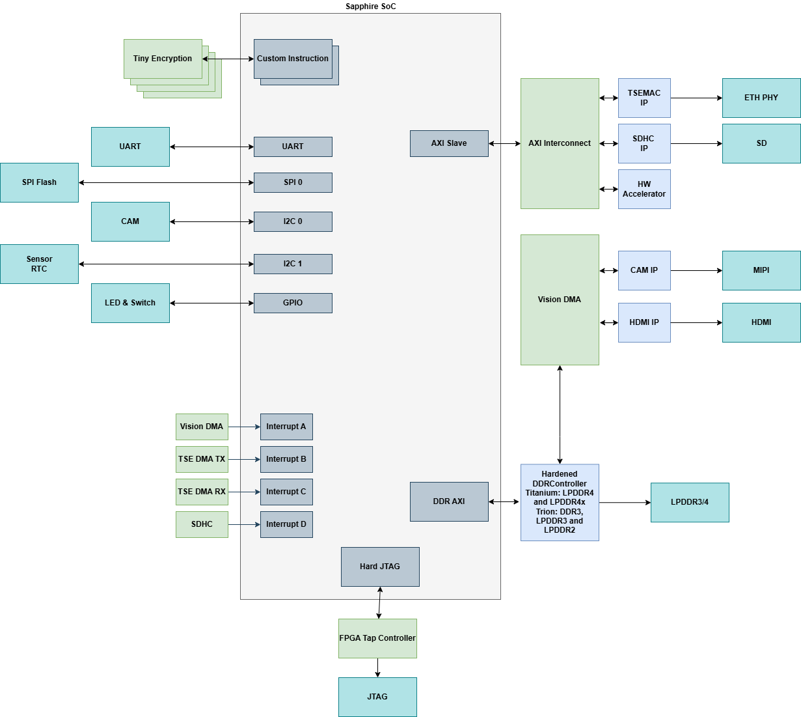
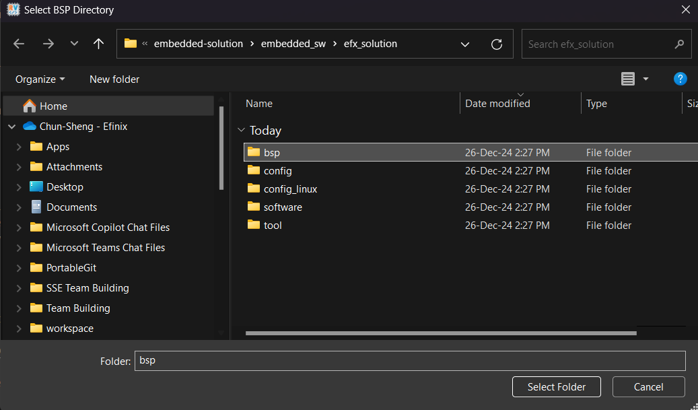
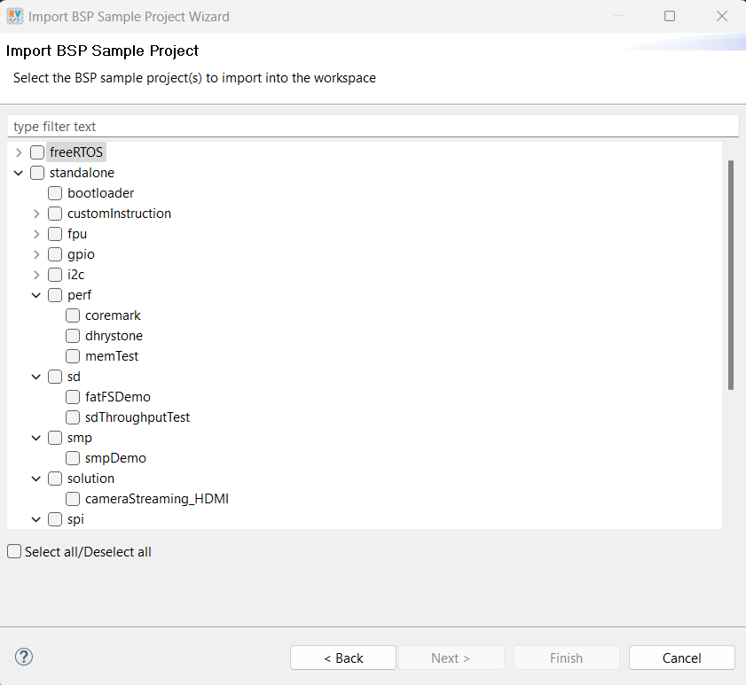

# Embedded System Solution Hub

Welcome to the Embedded System Solution Hub.

- [Overview](#overview)
- [Embedded System Solution Hardware Settings](#embedded-system-solution-hardware-settings)
- [Directory structure of Embedded System Solution](#directory-structure-of-embedded-system-solution)
- [Software Requirements](#software-requirements)
- [Getting Start](#getting-start)
    - [Installing USB Drivers](docs/hardware/setup_drivers.md)
    - [Setup Development Board: Titanium Ti180J484](docs/hardware/setup_devkit_Ti180J484.md)
    - [Setting up firmware folder](#setting-up-firmware-folder)
- [Embedded Solution Platform - RTL](#embedded-solution-platform---rtl)
    - [RTL: How to disable exisiting IP](docs/rtl/rtl-disable-ip.md)
    - [RTL: How to expand the platform](docs/rtl/platform-expansion.md)
- [Embedded Solution Platform - SW](#embedded-solution-platform---sw)
    - [SW: Address Mapping](docs/soc/addr_mapping_soc.md)
    - [SW: Supported App List](docs/app/ug_supported_app.md)
- [Linux Boot Up](https://github.com/Efinix-Inc/br2-efinix)
- [Documentation](#documentation)

## Overview

### Embedded System Solution Platform

The Embedded Solution platform is designed to support a diverse range of applications, particularly focusing on vision applications with integrated camera and display design. 
It is compatible with both Titanium and Trion devices, ensuring flexibility and high performance. Key features include support Triple-Speed Ethernet MAC, providing high-speed Ethernet support. This platform offers a comprehensive suite of applications for embedded software, making it suitable for various use cases. This platform supports both Sapphire SoC as well as High-Performance Sapphire SoC. 

#### Sapphire SoC Top Module Block Diagram



Key Features:
* Support Camera & Display Design for Vision Applications: Optimized for vision-based applications, providing enhanced capabilities for image processing and analysis.
* Support Titanium and Trion Devices: Ensures compatibility and flexibility with different hardware devices, catering to a broad spectrum of applications.
* Support Triple-Speed Ethernet MAC: Provides high-speed Ethernet support, essential for applications requiring fast data transmission.
* Wide Range of Applications for Embedded Software: Offers extensive support for various embedded software applications, making it versatile for numerous embedded system projects.
* Linux Support for Titanium Device (Ti375 & Ti180)
* FreeRTOS Support for all devices.


Available Embedded Software Demo:
- [Tsemac](docs/app/ug_ethernet.md)
  - [x] [lwipIperfServer](docs/app/ug_ethernet.md#lwipiperfserver)
- [Sensors](docs/app/ug_sensors.md)
  - [x] [sensor_DS3231_rtc](docs/app/ug_sensors.md#sensor_ds3231_rtc)
- [Solution](docs/app/ug_solution.md)
  - [x] [cameraStreaming_HDMI](docs/app/ug_solution.md#camerastreaming_hdmi)
  - [x] [sd_bmpStreaming_HDMI](docs/app/ug_solution.md#sd_bmpstreaming_hdmi)
  - [x] [capture_img_smp](docs/app/ug_solution.md#capture_img_smp)  
- [FreeRTOS](docs/app/ug_freertos.md)
  - [x] [freertosIperfDemo](docs/app/ug_freertos.md#freertosiperfdemo)
  - [x] [freertosMqttPlainTextDemo](docs/app/ug_freertos.md#freertosmqttplaintextdemo)
  - [x] [freertosEchoServerDemo](docs/app/ug_freertos.md#freertosechoserverdemo)
  - [x] [freertosFatDemo](docs/app/ug_freertos.md#freertosfatdemo)


## Embedded System Solution Hardware Settings

### Sapphire SoC CPU setting:
- 2 Cores
- IMACFD enabled
- Hard standard debug tap
- 128 bits EMIF
- 2KB OCR
- Custom Instruction

### Interfaces:
- 1 SD host controller
- 1 MIPI camera + 1 HDMI
- 1 Ethernet
- 2\*SPI + 3\*I2C + UART + 4 pins GPIO + 2\*user timers

**Note:**
- Below are some difference in terms of cpu setting between supported devices.

| Device       | System Clk (MHz) | Peripheral Clk (MHz)| Memory Clk (MHz) |      Cache Setting     |
|--------------|------------------|---------------------|------------------|------------------------|
| Ti375C529    |      1000         |         200         |       200        |4 ways 16kb I & D caches|
| Ti180J484    |      200         |         100         |       125        |8 ways 32kb I & D caches|
| T120F576     |       50         |          50         |        50        |2 ways 8kb I & D caches |
- The resolution of the display is set to 720p for the Ti180J484 device.

### Ethernet Throughput - TCP (Raw Mode)

| Device       | RX (Mbits/sec)   | TX (Mbits/sec)      |
|--------------|------------------|---------------------|
| Ti375C529    |      923        |         402         |
| Ti180J484    |      298         |         89         |
| T120F576     |       50         |          25         |

### Resource Consumption

| Device       | XLR              | Memory Block | DSP Block /Multiplier |
|--------------|------------------|---------------------|------------------|
| T120F576    |      81614/112128         |         707/1056         |       17/320 (Multiplier*)       |
| Ti180J484    |      77670/172800         |        612/1280         |       17/640       |
| Ti375C529     |       57656/ 362880         |          252/2688         |        0/1344       |

## Directory structure of Embedded System Solution

```
  +---embedded_sw
  ¦     +---embedded_solution
  ¦       +---bsp
  ¦       ¦    +---efinix
  ¦       ¦        +---EfxSapphireSoc
  ¦       ¦            +---app
  ¦       ¦            ¦   +---fatfs
  ¦       ¦            ¦   +---lwip
  ¦       ¦            +---include
  ¦       ¦            +---lauterbach_trace32
  ¦       ¦            +---linker
  ¦       ¦            +---openocd
  ¦       +---software
  ¦           +---freeRTOS
  ¦           ¦   +---common
  ¦           ¦   +---driver
  ¦           ¦   +---freertosDemo
  ¦           ¦   +---freertosEchoServerDemo
  ¦           ¦   +---freertosFatDemo
  ¦           ¦   +---freertosIperfDemo
  ¦           ¦   +---freertosMqttPlainTextDemo
  ¦           +---standalone 
  ¦           ¦   +---bootloader
  ¦           ¦   +---common
  ¦           ¦   +---customInstruction
  ¦           ¦   ¦   +---customInstructionDemo
  ¦           ¦   +---driver
  ¦           ¦   +---fpu
  ¦           ¦   ¦   +---fpuDemo
  ¦           ¦   +---gpio
  ¦           ¦   ¦   +---gpioDemo
  ¦           ¦   +---i2c
  ¦           ¦   ¦   +---sensor_DS3231_rtc
  ¦           ¦   +---perf
  ¦           ¦   ¦   +---coremark
  ¦           ¦   ¦   +---dhrystone
  ¦           ¦   ¦   +---memTest
  ¦           ¦   +---sd
  ¦           ¦   ¦   +---sdThroughputTest
  ¦           ¦   +---smp
  ¦           ¦   ¦   +---smpDemo
  ¦           ¦   +---spi
  ¦           ¦   ¦   +---spiDemo
  ¦           ¦   +---timer
  ¦           ¦   ¦   +---clintTimerInterruptDemo
  ¦           ¦   ¦   +---userTimerDemo
  ¦           ¦   ¦   +---watchdogDemo
  ¦           ¦   +---uart
  ¦           ¦   ¦   +---uartEchoDemo
  ¦           ¦   ¦   +---uartInterruptDemo
  ¦           +---tsemac
  ¦           ¦   +---lwipIperfServer
  ¦           +---solution
  ¦               +---capture_img_smp
  ¦               +---cameraStreaming_HDMI
  ¦               +---sd_bmpStreaming_HDMI
  +---source
  ¦   +---submodules
  ¦        +---cam
  ¦        +---common               
  ¦        +---hdmi_display
  ¦        ¦   +---display
  ¦        ¦       +---mif_yuv
  ¦        +---hw_accel         

```

## Software Requirements

### Efinity Software Version 

- [Efinity 2025.1.110](https://www.efinixinc.com/support/efinity.php) [v2025.1]

- Follow the official [documentation](https://www.efinixinc.com/support/docsdl.php?s=ef&pn=UG-EFN-SOFTWARE) on installation process.

### Efinity RISC-V Embedded Software IDE

- [v2025.1](https://www.efinixinc.com/support/efinity.php) and above

- Follow the official [documentation](https://www.efinixinc.com/support/docsdl.php?s=ef&pn=SAPPHIREUG) on installation process 

- Learn more at the [official website](https://www.efinixinc.com/products-efinity-riscv-ide.html)

### Additional Software needed for ethernet-related demo
- [iperf2](https://iperf.fr/download/windows/iperf-2.0.9-win64.zip)
- [iPerf3](https://iperf.fr/download/windows/iperf-3.1.3-win64.zip)
- [EchoTool](https://github.com/pbansky/EchoTool/releases/download/v1.5.0.0/echotool.exe)
- [Mosquitto](https://mosquitto.org/download/)

## Getting Start

### Setting up the development kit

* [Setup Development Board: Titanium Ti180J484](docs/hardware/setup_devkit_Ti180J484.md)

### Setting up firmware folder 

1. Git clone / download from the release.
2. Type command on terminal to switch branch :

    ```
    git checkout Ti180J484
    ```
    
2. By launching [Efinity RISC-V Embedded Software IDE](https://www.efinixinc.com/support/efinity.php), users are required to import the [bsp](embedded_sw/efx_solution/bsp) shown below:
<br> 

3. Once the BSP is selected, available BSP project can be imported to the workspace. <br>



Note: Please refer [List of supported app](docs/app/ug_supported_app.md) for different devices. 

## Embedded Solution Platform - RTL

* [RTL: How to disable exisiting IP](docs/rtl/rtl-disable-ip.md)
* [RTL: How to expand the platform](docs/rtl/platform-expansion.md)

## Embedded Solution Platform - SW
* [SW: Address Mapping](docs/soc/addr_mapping_soc.md)
* [SW: Supported App List](docs/app/ug_supported_app.md)

## Documentation
- [Efinity Programmer User Guide](https://www.efinixinc.com/support/docsdl.php?s=ef&pn=UG-EFN-PGM)
- [Sapphire RISC-V SoC Datasheet](https://www.efinixinc.com/support/docsdl.php?s=ef&pn=SAPPHIREDS)
- [Sapphire RISC-V SoC Hardware and Software User Guide](https://www.efinixinc.com/support/docsdl.php?s=ef&pn=SAPPHIREUG)
- [Titanium Ti180 J484 Development Kit User Guide](https://www.efinixinc.com/support/docsdl.php?s=ef&pn=Ti180J484-DK-UG)


## Performance profile (this fork)

Measured on hardware (PC -> FPGA sustained TCP, gigabit LAN): **367 Mbit/s**
(vendor baseline 260 at 200 MHz; Efinix's published figure 298). Changes:
SoC 250 MHz (PLL div 5->4), lwIP PBUF_POOL_BUFSIZE 1536, MEM_SIZE 64K,
CHECKSUM_GEN_UDP=1 (also fixes DHCP - routers may drop checksum-0 DISCOVERs).

**Timing caveat:** at 250 MHz this design's io_systemClk closes to Fmax
~235 MHz (-0.25 ns setup, seed 3 / effort 2; a seed-7 / effort-3 run was
worse at 227). The shipped configuration is therefore a mild overclock that
runs clean on the bench at room temperature (verified: 8 consecutive 4 s
transfers plus a 20 s sustained run at ~355 Mbit/s, zero TCP aborts). For
guaranteed-by-STA operation, set the io_systemClk out_divider back to 5
(200 MHz) in the peri.xml - the lwIP tuning alone is still worth ~10-15%.

**Why not faster?** The link is 1000BASE-T full duplex (RTL8211FD-CG PHY on
the daughter card, rated 10/100/1000), so the wire ceiling is ~941 Mbit/s TCP
goodput. The gap is CPU-bound, not cache- or DMA-bound: at ~355 Mbit/s the
board processes ~30k frames/s, i.e. the entire per-frame budget of the
250 MHz RISC-V is ~8,000 cycles for interrupt entry, cache maintenance,
lwIP tcp_input, and ACK generation. An experimental firmware that batched
RX processing and replaced the per-frame `data_cache_invalidate_all()` with
one flush per burst measured *no* throughput gain (and was less stable), so
cache maintenance is not the bottleneck - the plateau is lwIP protocol
processing itself. Meaningful further gains would need TCP offload in
fabric or a hard-wired checksum/segmentation path, not firmware tuning.

## Hardware TCP sink (this fork) - 885 Mbit/s measured

Following the analysis above, this fork now terminates TCP **in fabric**:
`source/hw_tcp_sink.v` sits directly on the TSEMAC's 8-bit / 125 MHz AXI
streams (8 bit x 125 MHz = exactly 1 Gbps) and implements, in RTL:

- ARP responder and ICMP echo for `192.168.1.55`
- a single-connection TCP endpoint on port 5001: SYN/SYN-ACK/ACK handshake,
  cumulative ACK generation, FIN teardown, RST/idle-timeout recovery, and
  adoption of a fresh SYN from any state (auto-recovery from aborted peers)
- streaming TCP checksum verification on RX (frames failing it never touch
  connection state); TX checksums use the existing `MacTxLso` offload stage
  (TCP) plus IP/ICMP checksums computed in the engine - the exact contract
  lwIP used
- window scale (x16) advertising a ~1 MB window; payload is discarded at
  line rate, so the advertised window is always honest

An async gray-pointer FIFO crosses the RX stream from `rgmii_rxc` into
`io_tseClk`, where the parser, TCP state and TX generator run. The domain
closes timing at 192.8 MHz Fmax against its 125 MHz clock. The Sapphire
RISC-V performs only the one-time MAC/PHY register init
(`software/standalone/tsemac/hwTcpInit`) - **the CPU never touches a
packet**. The gDMA stays instantiated for the SoC memory map but its
streams are tied off.

Measured on hardware (PC -> FPGA, gigabit LAN, Windows sender):
**885 Mbit/s sustained over 30 s** (per-second worst case 860, best 895,
zero aborts across all runs; 881 Mbit/s over a separate 20 s run) =
**94 % of the ~941 Mbit/s theoretical TCP goodput ceiling**, vs
355-367 Mbit/s for the best lwIP/CPU configuration and 298 Mbit/s for
Efinix's published figure. Ping answers in ~1 ms with 0 % loss *while*
the TCP stream runs at full rate. Residual gap to 941 is sender-side
pacing plus rare wire-level FCS errors (26 counted over ~7 GB), each of
which costs a go-back-N recovery since the hardware endpoint does not
implement SACK.

Two synthesis gotchas cost a debug cycle each and are worth recording:
a `11'd2048` literal silently truncates to 0 (watch for VERI-1208), and
any asynchronous / mux-fed RAM read maps to a register array on Titanium
(no distributed RAM - the 16-kbit echo buffer as flops produced a netlist
that passed STA yet corrupted TCP under load; giving it a registered
prefetch read restored a clean BRAM and full throughput).

To rebuild the software (lwIP iperf) variant instead, revert the
`hw_tcp_sink` wiring in `source/top_soc.v` (git history has the DMA-stream
hookup) and run the `lwipIperfServer` firmware.
